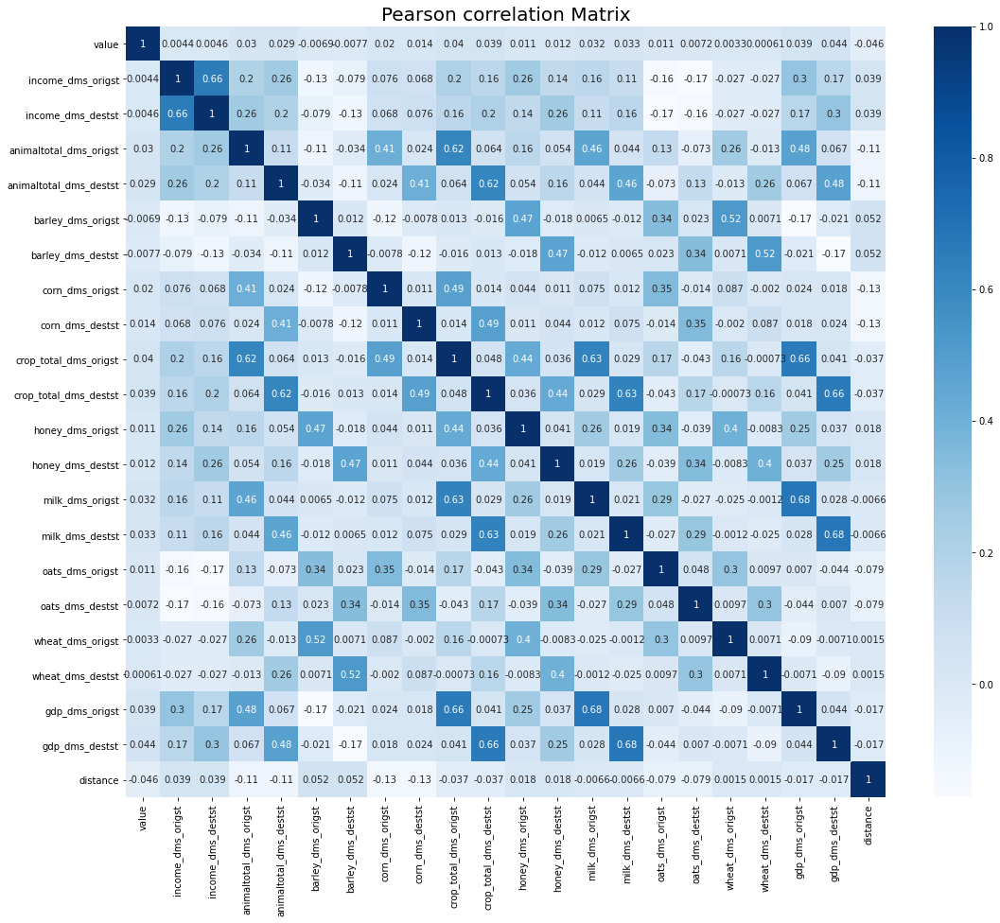
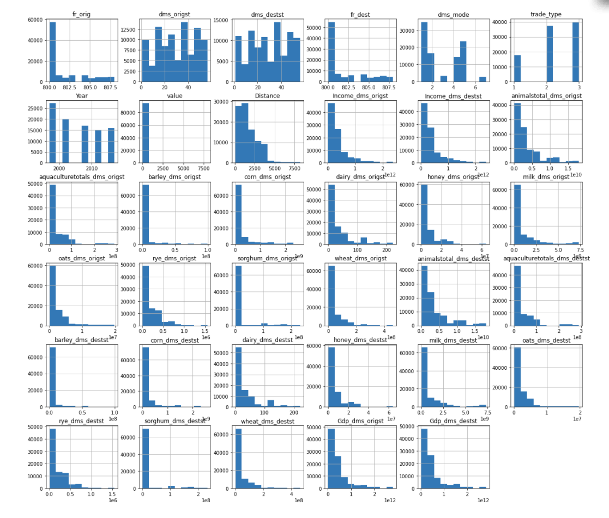
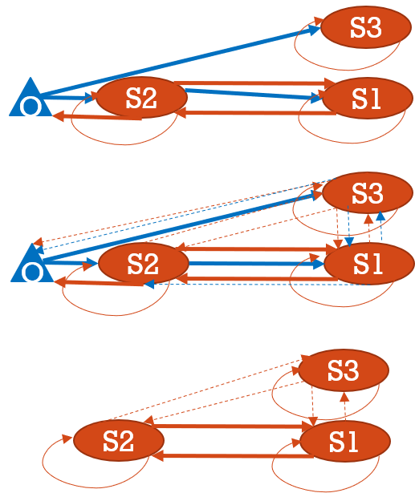

## Method

To estimate the bilateral food flow between state pairs, we employ Random forest and Neural Network model. 
A gravity model is used as baseline model. 

### Data sources

We used diverse data sources to obtain data for major years and those years are 1997, 2002, 2007, 2012 and 2017. Those data sources are described briefly below.

Bilateral Trade: We obtain data on agricultural and food commodity transfers between FAF zones in the United States. The Freight Analysis Framework Version 4 (FAF4) database provides empirical agricultural and food commodity transfers between FAF zones for the year 2012(Oak Ridge National Laboratory 2015). Second, we obtain statistical information on economic production within each US county.

Production: We used United States Department of Agriculture (USDA) data to determine state level production values for 10 selected food and crop categories in accordance with SCTG categorization, namely corn, dairy, honey, milk, oats, rice, rye, wheat, aquaculture and sorghum. The value is measured in tons.

Distance: To calculate the distance between states, we used the latitude and longitude data and used the haversine formula.

Income and GDP: We obtained economic data, i.e. income and GDP data from Bureau of Economic Analysis portal. For income we used income per capita values. All the values are measured in million dollars.

### Data Cleaning
#### EDA
The EDA is divided into two sections. First is Data Cleaning where we go through various key datasets and tidy them up so that they all can work together. In the second section, we will be looking at their distributions and their possible correlation between each other.
To begin with, we load the data for food flow. The data has coded features which has relevant meaning. They are described below.

fr: Foreign. Trade across borders. We won't be considering this data for our analysis as we are focussed on food flows among US states.

orig: Origin

dms: Domestic

dest: Destination

st: State

inmode: mode of import of international flows

outmode: mode of export of international flows

sctg2: Food category. This is a standard code used by Bureau of Trade Statistics for classifying food [BTS Guide]

value: value of food in dollars. tons: food value in weight.

After introducing the flow data, we utilized the latitude and longitude of states to calculate the haversine distance between origin and destination of food flows.
Next, we introduced the remaining data from their respective files. 

#### Data Preprocessing
In the exploratory data analysis, we manipulated the data to find appropriate features for the model. There are 39 features in total. In this analysis, we removed self-loops in the food flow network, i.e. the origin and destination of the domestic flows being the same.
Before moving towards building the neural network, we formatted the data type of different features to meet the model requirements (i.e. categorical or numerical).  To obtain categorical features, we create a function that takes the string value of the column and return the whole data-frame with a new one-hot encoded feature for the feature fed to the function. We also carefully removed some null values in many features to not lose any valuable data values. This was done by removing the features with missing percentage greater than 30%. To spot any collinearity and anomalies that might affect our results, we produced the correlation matrix and histogram of all variables as shown below.

{#fig:image6}

{#fig:image7}

Most of the crop production values are right tailed which means that we need to normalize the data before we feed it to our model. Also, we notice that the "value" feature is highly concentrated at one bin. The standard deviation for the dataset is very high and the quantile values are quite low, which suggests that we need to remove the major outliers from the dataset.

### Model

#### Neural network

In this analysis, we used neural network to predict the food flow between US states. We used two hidden layers with 30 and 12 neurons respectively with ReLu activation function. We used Adam optimizer function with a learning rate of 0.001, "mean squared error" loss function and RMSE as the metric. Batch size of 100 was considered with a validation split of 0.2 and number of epochs equals to 25. The results of the model run are discussed in the results and discussion section.

#### Random Forest
First of all, the FAF data needed to be expanded, because it does not include the case of no transaction, we will add the case of zero.
To meet Kaggle's memory limitations, whether the products are imported, exported or produced domestically is ignored in RF model. 
We group the bilateral flow data by origination state, destination state, commodity type, transportation mode and year.
As shown in Figure @fig:image1, the dotted-line is the no transaction situation, the flow from S2 to S1 in simplified figure is the sum of the flow export from foreign countries (transshipment via S2) and domestic flow produced in S2.

{#fig:image1}

Random forest (RF) is a tree-based algorithm.
The RF algorithm generates several independent trees through bootstrapping.
Each tree randomly select predictor variables.
The final output is determined by the average results of all trees. 
There are 637245 examples in the datasets 7(categories)x51(importers)x51(exporters)x5(years)x7(transportation modes) and 5 categorical variables ('origst' , 'destst', 'mode', 'sctg2', 'year') and 27 numeric variables.
We remove the variables with missing rate larger than 25\% like rice production, rye production and sorghum production.
Because we want to predict the trade "value", we need to find which variables are relevant to the trade.
Meanwhile, for those variables have high correlation, we need to carefully consider it to avoid the multimillionaires problems.
Here are some findings for correlations. The trade weight is inversely proportional to the distance between the two states and their total GDP, which conforms to the gravity model of transactions.
Here are some observations from the histgram: firstly all the production values follows a edge peak distribution.
We might need to normalize it when we build the model.
The value is very similar for different transcations.
There are few extreme large numbers.
After deleting the variables with high missing ratio, we still have several nans for production variables in the datasets.
There are two different possible explanations
(1) This kind of product is not grown or produced there
(2)Information is not disclosed for some reason. We cannot figure out the specific reason.
So we assume that all the nans are due to reason(1) then we set all nans as zeros.
Also in previous section, we have already dropped some columns with large missing data which decrease the bias introduced by set all nans as zeros.
The nominal categorical variables in this Food flow datasat are transformed to a format that works better with the regression algorithms using one hot encoding method.
Random Forests are good at dealing with outliers and different scale features but we also need to fit a linear model as baseline.
In order to prevent close to 0 weights in base model due to different scales of features, we standardize the features to center the feature columns at mean 0 with standard deviation 1.
After preparing the data for Random Forest model, we decide the hyperparameters for the RF model by applying the brute force grid search.

#### Baseline Model

To validate our model, we also try the gravity model.
The linear model like Ridge model is not suitable for the bilateral food flow estimation.
Gravity model is one of the most robust empirical models to illustrate the drivers in international trade:
bilateral trade between two countries is proportional to size, mostly measured in GDP and inversely proportional to “distance" between them, which commonly fitted through Poisson Pseudo Maximum Likelihood (PPML) method to deal with the zeros.
We use the python GLE library to do Poisson Psedo Maximum Likelihood regression.
The gravity model calculate the  $origst\times year$ and $destst\times year$ fixed effect and the impact of variables used in RF model.

 

