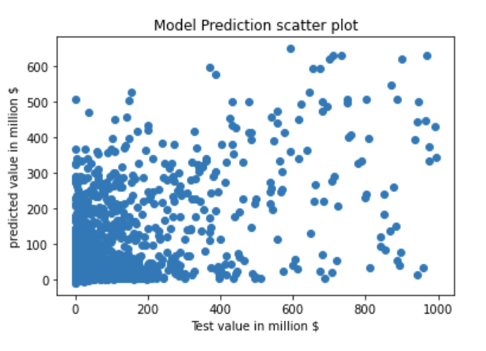

## Result

### Neural Network

As we saw in the last section, the selected value for the number of layers and neurons is 2, and 30 and 12 respectively. These specific values were selected by trying out multiple different layers and neurons combination to find the most efficient structure. The learning rate was kept at 0.001 with a batch size of 100. We find out that the $R^2$ score for the model came out to be 0.43. The figure below shows the scatter plot of the real test values vs the prediction.  

{#fig:image5}

### Random Forest
Through GridSearching, the hyperparameters we selected was 20 for max depth of tree and 50 for number of independent tree.
Figure @fig:image2 shows the estimation results. 
The validation $r^2$ is 0.86. RF model shows the better performance for the large flow.

{#fig:image2}

Figure @fig:image3 shows the importance of features on this bilateral food flow regression problem.

The red bars are the importance of the forest with inter-trees variability.  
As expected, commodity type, gdp of importors and gdp of exporters are informative. 
Surprisingly, distance and year shows less impact on the regressiom results. 
The performance of the distance variable is inconsistent with the law of the gravity model.
We consider that this may be becaues we use the log of harversine distance.

![Random Forest Feature Importance.features 0:21('value','income_dms_origst', 'income_dms_destst', 'animaltotal_dms_origst', 'animaltotal_dms_destst', 'barley_dms_origst', 'barley_dms_destst', 'corn_dms_origst', 'corn_dms_destst', 'crop_total_dms_origst', 'crop_total_dms_destst', 'honey_dms_origst', 'honey_dms_destst', 'milk_dms_origst', 'milk_dms_destst', 'oats_dms_origst', 'oats_dms_destst', 'wheat_dms_origst', 'wheat_dms_destst', 'gdp_dms_origst', 'gdp_dms_destst', 'distance’),22:72 (dms_origst),73:123 ( dms_destst),124:130 (transportation mode), 131:137 (commodity type), 138:142 (year)](images/features importance.png){#fig:image3}

### Baseline
Using the same data as RF model mentioned above, the validation accuracy $r^2$ of Ridge model is 0.049 because there are so many zeros in the dataset. 
We fitted gravity model to bilateral food flow data with PPML estimator, as shown in Figure @fig:image4.
As we specified the commodity type and transportation mode, there is no group variance. But the average $r^2$ for different commodity and transportation condition is about 0.25.  

{#fig:image4}
