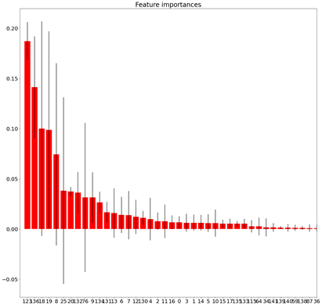

## Result

### Random Forest
Through GridSearching, the hyperparameters we select is max depth (20) and number of estimators (50).
Figure @  shows the estimation results. 
The validation $r^2$ is 0.86. RF model shows the better performance for the large flow.

{#fig:image2}

{#fig:image3}

### Baseline
Using the same data as RF model mentioned above, the validation accuracy $r^2$ of Ridge model is 0.049 because there are so many zeros in the dataset. 

{#fig:image4}
