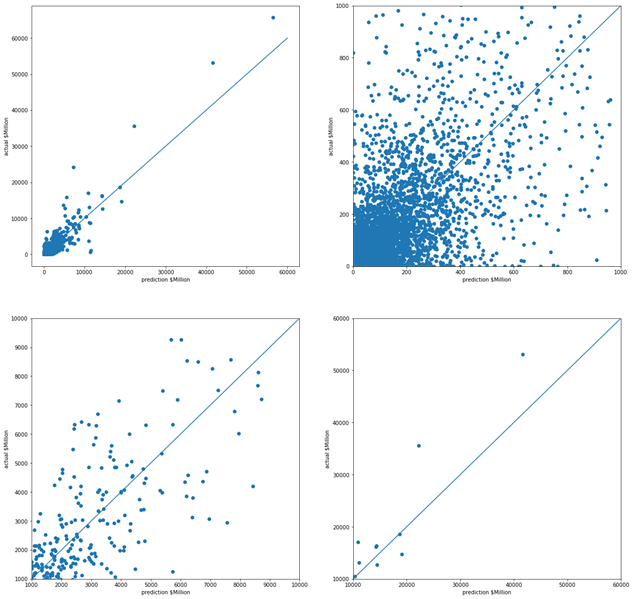
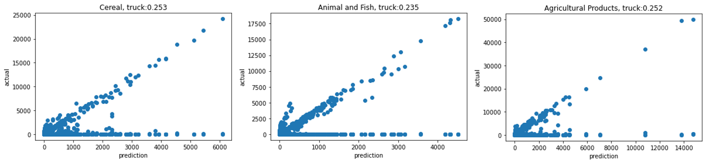

---
author-meta:
- Junren Wang
bibliography:
- content/manual-references.json
date-meta: '2020-12-06'
header-includes: '<!--

  Manubot generated metadata rendered from header-includes-template.html.

  Suggest improvements at https://github.com/manubot/manubot/blob/master/manubot/process/header-includes-template.html

  -->

  <meta name="dc.format" content="text/html" />

  <meta name="dc.title" content="Food Flow Project" />

  <meta name="citation_title" content="Food Flow Project" />

  <meta property="og:title" content="Food Flow Project" />

  <meta property="twitter:title" content="Food Flow Project" />

  <meta name="dc.date" content="2020-12-06" />

  <meta name="citation_publication_date" content="2020-12-06" />

  <meta name="dc.language" content="en-US" />

  <meta name="citation_language" content="en-US" />

  <meta name="dc.relation.ispartof" content="Manubot" />

  <meta name="dc.publisher" content="Manubot" />

  <meta name="citation_journal_title" content="Manubot" />

  <meta name="citation_technical_report_institution" content="Manubot" />

  <meta name="citation_author" content="Junren Wang" />

  <meta name="citation_author_institution" content="Department of Civil and Environmental Engineering, University of Illinois at Urbana-Champaign" />

  <link rel="canonical" href="https://junrenwang.github.io/foodflowproject/" />

  <meta property="og:url" content="https://junrenwang.github.io/foodflowproject/" />

  <meta property="twitter:url" content="https://junrenwang.github.io/foodflowproject/" />

  <meta name="citation_fulltext_html_url" content="https://junrenwang.github.io/foodflowproject/" />

  <meta name="citation_pdf_url" content="https://junrenwang.github.io/foodflowproject/manuscript.pdf" />

  <link rel="alternate" type="application/pdf" href="https://junrenwang.github.io/foodflowproject/manuscript.pdf" />

  <link rel="alternate" type="text/html" href="https://junrenwang.github.io/foodflowproject/v/781b902ca68bdc63462fc13b2d6f614a73320cae/" />

  <meta name="manubot_html_url_versioned" content="https://junrenwang.github.io/foodflowproject/v/781b902ca68bdc63462fc13b2d6f614a73320cae/" />

  <meta name="manubot_pdf_url_versioned" content="https://junrenwang.github.io/foodflowproject/v/781b902ca68bdc63462fc13b2d6f614a73320cae/manuscript.pdf" />

  <meta property="og:type" content="article" />

  <meta property="twitter:card" content="summary_large_image" />

  <link rel="icon" type="image/png" sizes="192x192" href="https://manubot.org/favicon-192x192.png" />

  <link rel="mask-icon" href="https://manubot.org/safari-pinned-tab.svg" color="#ad1457" />

  <meta name="theme-color" content="#ad1457" />

  <!-- end Manubot generated metadata -->'
keywords:
- Food flow
- Random Forest
- Neural Network
lang: en-US
manubot-clear-requests-cache: false
manubot-output-bibliography: output/references.json
manubot-output-citekeys: output/citations.tsv
manubot-requests-cache-path: ci/cache/requests-cache
title: Food Flow Project
...

<small><em>
This manuscript
([permalink](https://junrenwang.github.io/foodflowproject/v/781b902ca68bdc63462fc13b2d6f614a73320cae/))
was automatically generated
from [junrenwang/foodflowproject@781b902](https://github.com/junrenwang/foodflowproject/tree/781b902ca68bdc63462fc13b2d6f614a73320cae)
on December 6, 2020.
</em></small>

## Authors

+ **Junren Wang** 
    · {.inline_icon}
    [junrenwang](https://github.com/junrenwang) 
  <small>
     Department of Civil and Environmental Engineering, University of Illinois at Urbana-Champaign
  </small>

## Abstract {.page_break_before}

## Method

To estimate the bilateral food flow between state pairs, we employ Random forest and Neural Network model. 
A gravity model is used as baseline model. 

### Random Forest

First of all, the FAF data needed to be expanded, because it does not include the case of no transaction, we will add the case of zero.
To meet Kaggle's memory limitations, whether the products are imported, exported or produced domestically is ignored in RF model. 
We group the bilateral flow data by origination state, destination state, commodity type, transportation mode and year.
As shown in Figure @fig:image1, the dotted-line is the no transaction situation, the flow from S2 to S1 in simplified figure is the sum of the flow export from foreign countries (transshipment via S2) and domestic flow produced in S2.

{#fig:image1}

Random forest (RF) is a tree-based algorithm.
The RF algorithm generates several independent trees through bootstrapping.
Each tree randomly select predictor variables.
The final output is determined by the average results of all trees. 
There are 637245 examples in the datasets 7(categories)x51(importers)x51(exporters)x5(years)x7(transportation modes) and 5 categorical variables ('origst' , 'destst', 'mode', 'sctg2', 'year') and 27 numeric variables.
We remove the variables with missing rate larger than 25\% like rice production, rye production and sorghum production.
Because we want to predict the trade "value", we need to find which variables are relevant to the trade.
Meanwhile, for those variables have high correlation, we need to carefully consider it to avoid the multimillionaires problems.
Here are some findings for correlations. The trade weight is inversely proportional to the distance between the two states and their total GDP, which conforms to the gravity model of transactions.
Here are some observations from the histgram: firstly all the production values follows a edge peak distribution.
We might need to normalize it when we build the model.
The value is very similar for different transcations.
There are few extreme large numbers.
After deleting the variables with high missing ratio, we still have several nans for production variables in the datasets.
There are two different possible explanations
(1) This kind of product is not grown or produced there
(2)Information is not disclosed for some reason. We cannot figure out the specific reason.
So we assume that all the nans are due to reason(1) then we set all nans as zeros.
Also in previous section, we have already dropped some columns with large missing data which decrease the bias introduced by set all nans as zeros.
The nominal categorical variables in this Food flow datasat are transformed to a format that works better with the regression algorithms using one hot encoding method.
Random Forests are good at dealing with outliers and different scale features but we also need to fit a linear model as baseline.
In order to prevent close to 0 weights in base model due to different scales of features, we standardize the features to center the feature columns at mean 0 with standard deviation 1.
After preparing the data for Random Forest model, we decide the hyperparameters for the RF model by applying the brute force grid search.

### Baseline Model

To validate our model, we also try the gravity model.
The linear model like Ridge model is not suitable for the bilateral food flow estimation.
Gravity model is one of the most robust empirical models to illustrate the drivers in international trade:
bilateral trade between two countries is proportional to size, mostly measured in GDP and inversely proportional to “distance" between them, which commonly fitted through Poisson Pseudo Maximum Likelihood (PPML) method to deal with the zeros.
We use the python GLE library to do Poisson Psedo Maximum Likelihood regression.
The gravity model calculate the  $origst\times year$ and $destst\times year$ fixed effect and the impact of variables used in RF model.

### Data
#### Bilateral food flow
The FAF dataset includes every 5 years data from 1997 to 2017. 

#### Other features
income data

gdp data

production data

distance

## Result

### Random Forest
Through GridSearching, the hyperparameters we selected was 20 for max depth of tree and 50 for number of independent tree.
Figure @fig:image2 shows the estimation results. 
The validation $r^2$ is 0.86. RF model shows the better performance for the large flow.

{#fig:image2}

Figure @fig:image3 shows the importance of features on this bilateral food flow regression problem.

The red bars are the importance of the forest with inter-trees variability.  
As expected, commodity type, gdp of importors and gdp of exporters are informative. 
Surprisingly, distance and year shows less impact on the regressiom results. 
The performance of the distance variable is inconsistent with the law of the gravity model.
We consider that this may be becaues we use the log of harversine distance.

![Random Forest Feature Importance.features 0:21('value','income_dms_origst', 'income_dms_destst', 'animaltotal_dms_origst', 'animaltotal_dms_destst', 'barley_dms_origst', 'barley_dms_destst', 'corn_dms_origst', 'corn_dms_destst', 'crop_total_dms_origst', 'crop_total_dms_destst', 'honey_dms_origst', 'honey_dms_destst', 'milk_dms_origst', 'milk_dms_destst', 'oats_dms_origst', 'oats_dms_destst', 'wheat_dms_origst', 'wheat_dms_destst', 'gdp_dms_origst', 'gdp_dms_destst', 'distance’),22:72 (dms_origst),73:123 ( dms_destst),124:130 (transportation mode), 131:137 (commodity type), 138:142 (year)](images/features importance.png){#fig:image3}

### Baseline
Using the same data as RF model mentioned above, the validation accuracy $r^2$ of Ridge model is 0.049 because there are so many zeros in the dataset. 
We fitted gravity model to bilateral food flow data with PPML estimator, as shown in Figure @fig:image4.
As we specified the commodity type and transportation mode, there is no group variance. But the average $r^2$ for different commodity and transportation condition is about 0.25.  

{#fig:image4}

## Discussion

### Comparing the models

We compared the different model results. Among three models we employed, Random Forest showed the best prediction performance. We assume that the good performance of RF is due to (1) RF is good at deal with noise (2)   Also, NN and RF models both shows better prediction performance for larger trade flow.

### Limitations

There are several limitations in this study. 
Firstly, the distance used in this study is haversine distance. 
In other words, we don't consider the transportation route. 
The random forest might underfit,  we try several hyperparameters  under the limitation of long time computing time for Random Forest. 
We don’t consider the commodities trade mode(Domestic, imports or exports) in Random Forest model.
At the same time, different years also have a great impact on transactions, which may be due to the impact of inflation. 
We should add GDP deflator to eliminate this impact.

## References {.page_break_before}

<!-- Explicitly insert bibliography here -->

